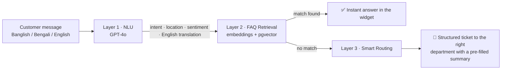
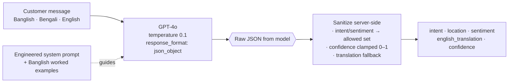
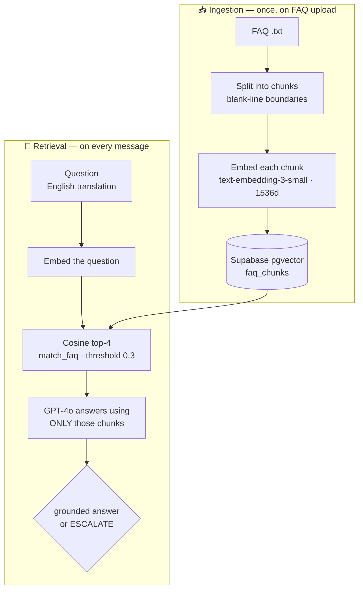

<div align="center">

# 🗨️ Shoduttor.ai

### Multilingual, Banglish-native AI customer support — one line of code, works on any website.

[](https://react.dev)
[](https://vitejs.dev)
[](https://nodejs.org)
[](https://expressjs.com)
[](https://openai.com)
[](https://supabase.com)
[](https://tailwindcss.com)

</div>

> **সদুত্তর (Shoduttor)** = *"a fitting, correct answer."* An AI that gives the right answer to every customer message — even when it's typed in **Banglish** ("amar net cholche na"), Bengali, English, or a messy mix of all three.

---

## 🔗 Live demo

| What | Link |
|------|------|
| 🧑‍💼 **Admin dashboard** | [open `/admin`](https://shoduttor-ai-git-main-op143aryan-5491s-projects.vercel.app/admin) |
| 💬 **Chat widget demo** (Grameenphone · Pathao · JerseyVerse) | [open `/demo`](https://shoduttor-ai-git-main-op143aryan-5491s-projects.vercel.app/demo) |
| 🟢 **Embedded-on-a-site demo** | [open `/gp-demo.html`](https://shoduttor-ai-git-main-op143aryan-5491s-projects.vercel.app/gp-demo.html) |
| 📦 **The widget script** | [`/widget.js`](https://shoduttor-ai-git-main-op143aryan-5491s-projects.vercel.app/widget.js) |
| ⚙️ **Backend API** | [`/health`](https://shoduttor-ai.onrender.com/health) |

> ⏳ The API runs on Render's free tier and sleeps after 15 min idle — the first request may take ~30s to wake.

---

## The problem

Bangladesh has **170M+ mobile users**, and almost none of them message businesses in clean English or formal Bangla. They type **Banglish** — Bengali sounds written in English letters, mixed with English words, with no fixed spelling and mixed grammar. It looks different in every message:

| Industry | A real customer message | What they mean |
|---|---|---|
| 📱 Telecom | `amar net cholche na` | my internet isn't working |
| 🛵 Food delivery | `khabar ashe nai keno` | why hasn't my food arrived? |
| 👕 Clothing / retail | `ei jersey ta stock e ache?` | is this jersey in stock? |
| ✈️ Travel | `tour package koto?` | how much is the tour package? |

Traditional chatbots are built for English or formal Bangla, so they **fail on this completely** — the words aren't in any dictionary and the grammar is inconsistent. The result: *every* message gets dumped on a human agent to read, decode, categorize, and answer by hand. At scale that's **millions of taka in avoidable support cost** — plus slow replies and frustrated customers.

## How it works

Shoduttor is a three-layer pipeline. It's **business-agnostic** — telecom, retail, banking, food delivery, anything — because answers come from each business's own uploaded knowledge base (FAQs, policies, catalogs).



1. **NLU** — every message is parsed by GPT-4o into `{ intent, location, sentiment, english_translation, confidence }`.
2. **FAQ retrieval** — the translation is embedded (`text-embedding-3-small`) and matched against the business's FAQ vectors in **Supabase pgvector** (cosine similarity). A confident match is answered instantly.
3. **Smart routing** — no match → a ticket is created with the structured summary and routed to the right department. Agents read clean English, never raw Banglish.

## 🧠 The four AI capabilities (under the hood)

Shoduttor is built from four composable AI skills. *(Full breakdown + the production-grade RAG checklist: [`skills.md`](skills.md).)*

### 1 · Banglish NLU
Every message is parsed by **GPT-4o** (JSON mode, `temperature 0.1`) into a clean, structured object — then **sanitized server-side** (values coerced to an allowed set, confidence clamped) so downstream code is always safe.



```jsonc
"amar mb kete gese keno"
→ { "intent": "billing", "location": null, "sentiment": "frustrated",
    "english_translation": "Why was my internet data deducted?", "confidence": 0.9 }
```

### 2 · FAQ Semantic Retrieval — RAG, built from scratch (no LangChain)
Instead of answering from memory (and hallucinating), Shoduttor **retrieves** the business's own FAQ chunks and **augments** the prompt so GPT-4o **generates** a grounded answer. Chunk → embed (`text-embedding-3-small`) → store in **Supabase pgvector** → cosine top-4 → grounded answer, or `ESCALATE` if the FAQ doesn't cover it.



### 3 · Smart Ticket Routing
Unresolved messages become **structured tickets** routed to the right department (Billing · Technical · Subscriptions · Product · Logistics · Account · Customer Relations · General). Agents read a pre-filled English summary (`intent + location + sentiment + translation`) instead of decoding raw Banglish — cutting average handling time.

### 4 · Shadow DOM Widget
The embeddable widget attaches a **Shadow DOM** (`:host { all: initial }`), so the host site's CSS **can't reach in** and the widget's CSS **can't leak out** — "one script tag, works everywhere" actually holds. Zero dependencies, pure vanilla JS, verified against hostile host-page CSS.

## 🛡️ Cost & abuse protection

The chat endpoint is public (any website can embed the widget) and every message costs OpenAI credits — so it's guarded by three server-side layers, keyed on things an attacker can't cheaply reset (**no fragile client-side tokens**):

- **Per-IP rate limiting** — 20 messages/min per IP; bursts get a `429`.
- **Per-business daily budget** — a hard, durable cap (default **60 messages/business/day**) stored **atomically** in Supabase and checked *before* any OpenAI call, so an over-quota business spends **nothing**.
- **Message-length cap** — bounds per-request token cost.

Everything is env-configurable, and the quota check **fails open** (never breaks live chat) if the DB is unreachable.

## ✨ Features

- 🌐 **Multilingual NLU** — understands Banglish, Bengali, English and mixes of them.
- 🧩 **One-line embed** — a single `<script>` tag, isolated from the host site via **Shadow DOM**.
- 📄 **Bring-your-own FAQ** — upload a `.txt`; it's chunked, embedded, and answered from automatically.
- 🎯 **Intent · location · sentiment** extraction on every message.
- 🎫 **Auto-routing** to departments (Billing, Technical, Logistics, …) with pre-filled summaries.
- 📊 **Live admin dashboard** — KPI cards, a resolution donut, and an auto-refreshing ticket table.
- 🎨 **Per-business branding** — color, greeting, and even the launcher icon (e.g. ⚽ for a football store).

## 🧩 Add it to any website

Paste **one line** before `</body>` — no rebuild, works on WordPress, Shopify, Wix, custom sites:

```html
<script
  src="https://shoduttor-ai-git-main-op143aryan-5491s-projects.vercel.app/widget.js"
  data-business-id="your-business-id"
  data-primary-color="#00A550"
  data-greeting="Apnar ki help lagbe?"
  data-icon="💬"
  defer>
</script>
```

| Attribute | Required | Default | Description |
|-----------|----------|---------|-------------|
| `data-business-id` | ✅ | — | Your business ID (matches your uploaded FAQ) |
| `data-primary-color` | | `#00A550` | Hex theme color |
| `data-position` | | `bottom-right` | `bottom-right` · `bottom-left` · `top-right` · `top-left` |
| `data-greeting` | | `How can I help you?` | First message when the widget opens |
| `data-icon` | | `💬` | Launcher bubble icon (emoji) |

## 🛠 Tech stack

| Layer | Tech |
|-------|------|
| Widget | Vanilla JS + **Shadow DOM** (zero dependencies) |
| Frontend | React 18 · Vite 6 · Tailwind v4 · Recharts |
| Backend | Node.js · Express |
| AI | OpenAI **GPT-4o** (NLU + answers) · **text-embedding-3-small** |
| Database | **Supabase** (Postgres + pgvector) |
| Hosting | **Vercel** (frontend) · **Render** (backend) |

## 📁 Project structure

```
shoduttor/
├── client/                 # React frontend (admin + demo + widget.js)
│   ├── src/pages/          # AdminDashboard, WidgetDemo
│   ├── src/components/      # ChatWidget, FAQUploader, TicketList, ResolutionDonut, BusinessSelect …
│   └── public/widget.js    # the standalone Shadow-DOM embeddable widget
├── server/                 # Express backend
│   ├── routes/             # chat · nlu · faq · tickets · businesses
│   ├── services/           # nlu · retrieval · embeddings
│   └── schema.sql          # Supabase tables + match_faq()
├── demo/                   # sample FAQs + gp-demo.html
├── render.yaml             # Render blueprint (backend)
└── client/vercel.json      # Vercel SPA config (frontend)
```

## ⚙️ Run locally

**Backend** (port 3001):
```bash
cd server
npm install
# create server/.env with OPENAI_API_KEY, SUPABASE_URL, SUPABASE_SERVICE_KEY
node index.js
```

**Frontend** (port 5173):
```bash
cd client
npm install
# create client/.env with VITE_API_URL=http://localhost:3001
npm run dev      # → http://localhost:5173/admin
```

> Run [`server/schema.sql`](server/schema.sql) once in the Supabase SQL editor first (enables pgvector + creates the tables).

## 🔌 API reference

| Method | Endpoint | Purpose |
|--------|----------|---------|
| `POST` | `/api/chat` | Main pipeline — NLU → FAQ → routing. Body: `{ message, business_id }` |
| `POST` | `/api/nlu` | NLU only (debug). Body: `{ message }` |
| `POST` | `/api/faq/upload` | Upload a `.txt` FAQ (multipart `file` or JSON `text`) |
| `GET`  | `/api/tickets?business_id=…` | List tickets (+ `/stats`) |
| `GET`  | `/api/businesses` | Distinct business IDs with data |
| `GET`  | `/health` | Liveness check |

```bash
curl -X POST https://shoduttor-ai.onrender.com/api/chat \
  -H "Content-Type: application/json" \
  -d '{"message":"amar net cholche na","business_id":"grameenphone"}'
```

## 📚 Docs

- [`skills.md`](skills.md) — deep dive on all four AI skills, every diagram, and the production-grade RAG checklist
- [`AGENTS.md`](AGENTS.md) — contributor / AI-agent guide (structure, conventions, test commands)

## ☁️ Deployment

- **Backend → Render:** *New → Blueprint* on the repo (reads [`render.yaml`](render.yaml)), paste the 3 secrets.
- **Frontend → Vercel:** import the repo, root = `client`, framework = Vite, set `VITE_API_URL` to the Render URL.

---

<div align="center">
<sub>Built with Banglish in mind 🇧🇩 — Banglish is our edge, not our limit.</sub>
</div>
