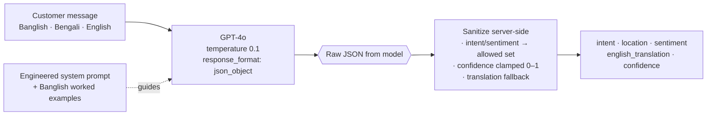
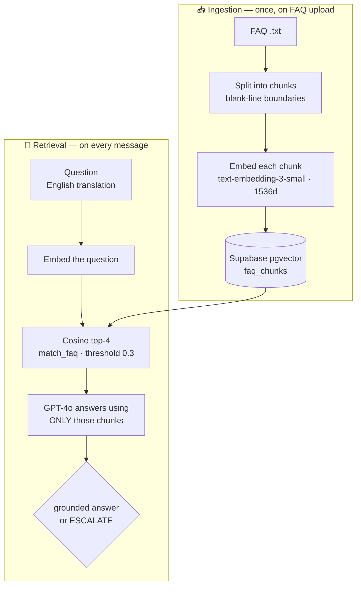
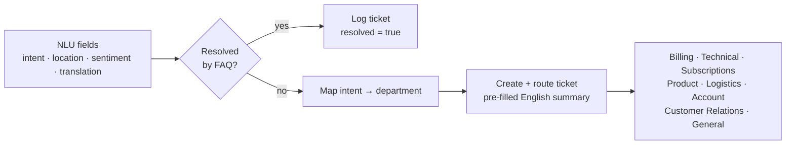
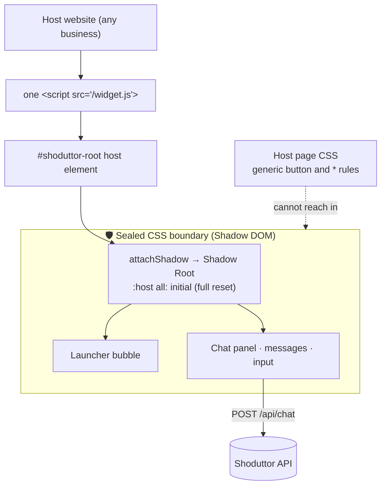
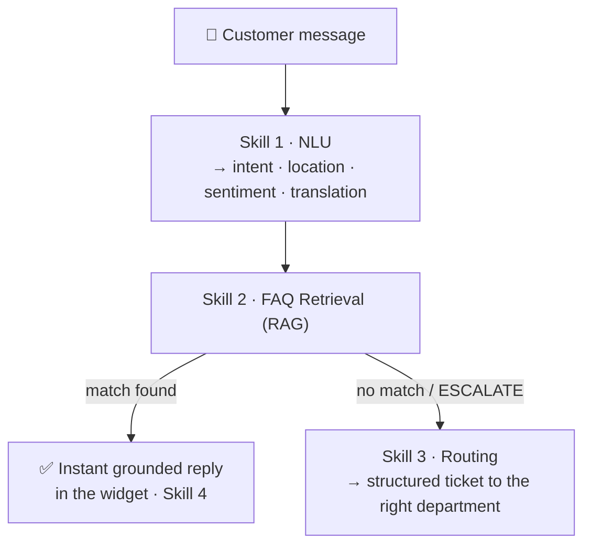

# skills.md — the 4 AI capabilities inside Shoduttor.ai

Shoduttor.ai is built from four composable AI "skills". This document explains what each one does,
where it lives, and how it behaves.

---

## Skill 1 — Banglish NLU (Natural Language Understanding)

**What:** Turns a raw, informal customer message — written in Banglish (romanized Bengali mixed with
English), Bengali script, or plain English — into a clean, structured object.

**How:** A single GPT-4o call (`model: "gpt-4o"`, `temperature: 0.1`,
`response_format: { type: "json_object" }`) with a carefully engineered system prompt and worked
examples. The output is sanitized server-side (intent/sentiment coerced to allowed values, confidence
clamped to 0–1) so downstream code is always safe.

**Where:** [`server/services/nlu.js`](server/services/nlu.js) — also exposed in isolation at `POST /api/nlu`.

**Input → Output:**
```
"amar mb kete gese keno"
→ {
    "intent": "billing",
    "location": null,
    "sentiment": "frustrated",
    "english_translation": "Why was my internet data deducted?",
    "confidence": 0.9
  }
```

Intents: `billing · technical · subscription · product · delivery · account · complaint · general`
(universal set — fits telecom, retail, banking, food delivery, SaaS).



---

## Skill 2 — FAQ Semantic Retrieval

**What:** Finds the parts of a business's own FAQ that actually answer the customer's question — by
*meaning*, not keywords — and generates a short answer from them (or signals that none fit).

**How:**
1. On upload, the FAQ document is split into chunks and each chunk is embedded with
   **`text-embedding-3-small`** (1536-dim) and stored in **Supabase pgvector**.
2. At query time, the English translation is embedded and compared against that business's chunks via
   **cosine similarity** (`match_faq` SQL function), keeping matches above a **0.3 threshold** (top 4).
3. GPT-4o answers using *only* the retrieved chunks, or returns the literal string `ESCALATE` if the
   FAQ doesn't cover the question.

**Where:** embedding in [`server/services/embeddings.js`](server/services/embeddings.js); search +
answer in [`server/services/retrieval.js`](server/services/retrieval.js); SQL in
[`server/schema.sql`](server/schema.sql).

> Why semantic search? Customers never phrase questions the way an FAQ is written. Embeddings let
> "amar net cholche na" match an FAQ entry titled "Internet not working" even with zero shared words.

### This is RAG (Retrieval-Augmented Generation)

Skill 2 is a from-scratch **RAG** pipeline — built directly on the OpenAI + Supabase SDKs, **without
LangChain or any RAG framework**. Instead of letting the model answer from memory (and hallucinate),
we *retrieve* the business's own FAQ chunks and *augment* the prompt so the model *generates* a grounded
answer.



### How it maps to a production-grade RAG checklist

| Production RAG practice | Shoduttor today | To productionize |
|---|---|---|
| Chunking | split on blank lines, >20 chars | tune size/overlap, semantic chunking |
| Embedding model | `text-embedding-3-small` (1536d) | evaluate models on domain data |
| Vector store | Supabase **pgvector** (ivfflat, cosine) | keep; add HNSW at scale |
| Multi-tenant filter | ✅ per-business (`business_id`) | — already done |
| Hybrid search (vector + keyword/BM25) | vector only | add BM25 + rank fusion |
| Reranking top-k | none | add a reranker (e.g. Cohere) |
| Evaluation (precision@k, recall@k) | none | add a labeled eval set + metrics |
| Idempotent ingestion / dedup | appends chunks | deterministic IDs to dedupe |

> Honest framing: the **core RAG loop is complete and correct** (embed → vector search → grounded
> generation with an anti-hallucination guard). Hybrid search, reranking, and evaluation are the
> upgrades you'd add to scale it from a strong prototype to a hardened production system.

---

## Skill 3 — Ticket Routing

**What:** When the FAQ can't resolve a message, Shoduttor creates a structured ticket and routes it to
the correct human department — so agents receive a clean English summary instead of raw Banglish.

**How:** The extracted intent maps to a department, and the NLU's structured fields (intent, location,
sentiment, English translation) become the ticket's pre-filled summary. Every message (resolved or
escalated) is logged to the `tickets` table for the admin dashboard and stats.

**Intent → Department map:**

| Intent | Department |
|--------|-----------|
| billing | Billing Team |
| technical | Technical Support |
| subscription | Subscriptions Team |
| product | Product Support |
| delivery | Logistics Team |
| account | Account Team |
| complaint | Customer Relations |
| general | General Support |

**Where:** [`server/routes/chat.js`](server/routes/chat.js) (`DEPARTMENT_BY_INTENT`).

**Result:** average handling time drops because agents read a structured summary
(`intent + location + sentiment + English translation`) rather than decoding raw Romanized Bengali.



---

## Skill 4 — Shadow DOM Widget Embedding

**What:** A zero-dependency chat widget any business adds to their existing website with **one line of
code** — no rebuild, no framework, no CSS conflicts.

```html
<script src="https://shoduttor-ai.onrender.com/widget.js"
        data-business-id="grameenphone"
        data-primary-color="#00A550"
        data-greeting="Apnar ki help lagbe?" defer></script>
```

**How:** The widget creates a host element and attaches a **Shadow DOM** (`attachShadow`), then injects
all of its markup and styles *inside* that sealed boundary. The host page's CSS cannot reach in
(`:host { all: initial }`) and the widget's CSS cannot leak out — so it looks identical on every site.
Config is read from the script tag's `data-*` attributes; messages are sent to `POST /api/chat` and the
reply is rendered with intent/sentiment badges (and a ticket number on escalation). Pure vanilla JS.

**Where:** [`client/public/widget.js`](client/public/widget.js) — must stay dependency-free since it
runs on third-party domains. Verified against hostile host-page CSS in browser tests.

> Why Shadow DOM? When your widget loads on someone else's site, their `button {}` and `* {}` rules
> would otherwise restyle and break it. Shadow DOM is the isolation layer that makes "one script tag,
> works everywhere" actually true.



---

### How the skills compose


